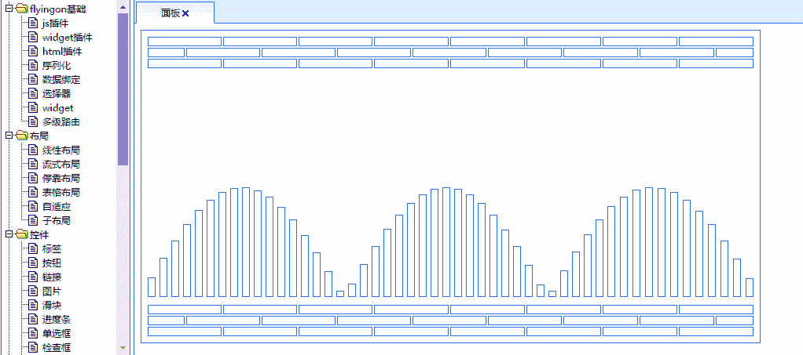
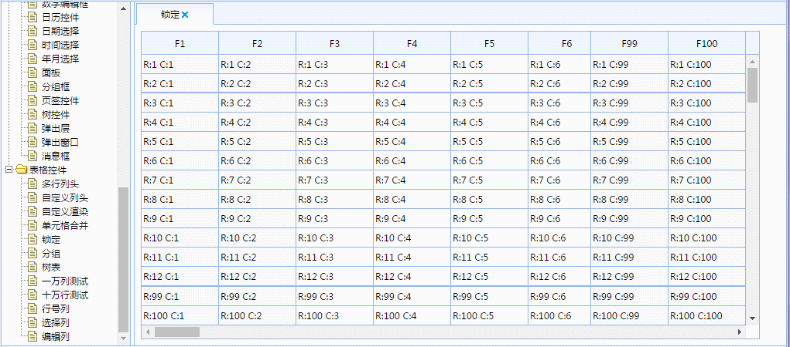
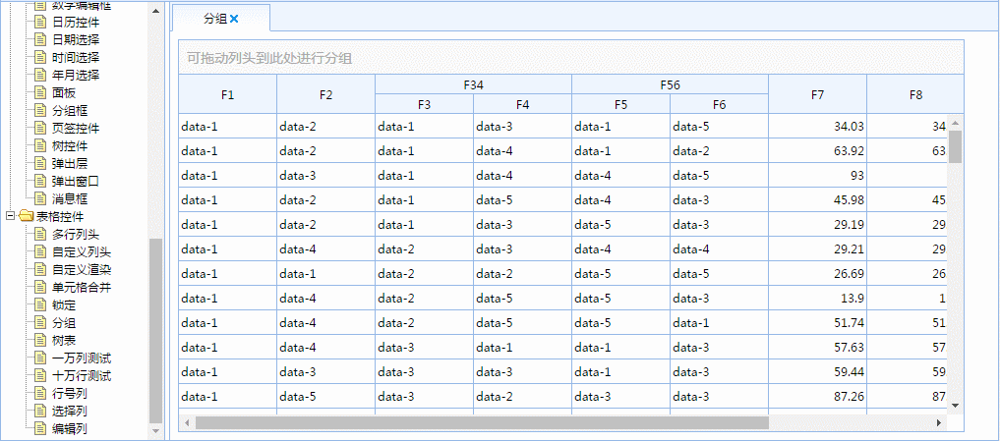
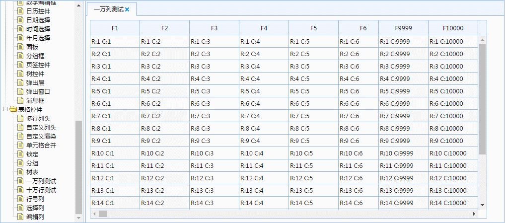
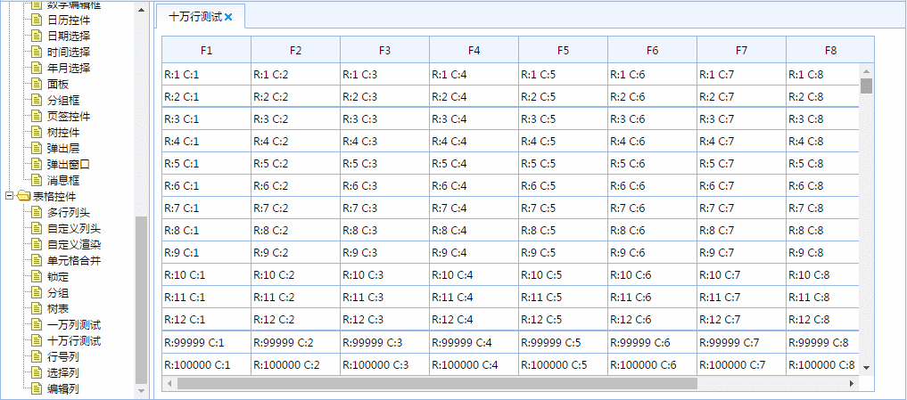
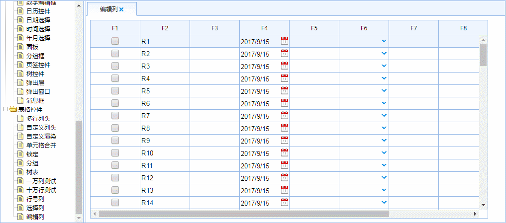

flyingon javascript library
========

flyingon是一个100%使用原生javascript开发的前端开发库

不依赖任何其它第三方库, 小巧轻便(包含标准控件不足250K, 再经过gzip压缩不到100K, 按需定制移除不使用部分可以更小)

性能极好, 可在浏览器中打开相关示例使用开发者工具查看实际性能情况

简单易用, 易扩展, 易维护, 增强的javascript面向对象支持具有不下于Java及C#等标准面向对象语言的能力

开发方式多样, 支持面向对象开发, 选择器, 视图模型及数据绑定, 可选择多种开发方式同时使用

功能强大, 用户使用flyingon标准库即可开发常见web应用, 标准库包含功能如下：

1. 核心库(类及继承, 属性, 事件, 序列化及反序列化, 选择器, 视图模型, 数据绑定, ajax, 模块及依赖, 路由...)
2. 布局系统(Panel, Splitter, GroupBox, Tab...)
3. 基础控件(Button, TextBox, ComboBox, Date...)
4. 高级控件(Tree, Grid, TreeGrid...)

浏览器支持：IE8+ chrome2+ Firefox3+ Safari5+ Opera11+

[在线演示](https://freeoasoft.github.io/flyingon/samples/index.html)(注:因为github的缘故,有时会出现卡顿或无法访问, 请耐心等待或下载示例到本地运行samples目录下的index.html)

自适应布局展示:

表格同时锁定行及列展示:

表格拖拉分组展示:

一万表格列展示:

十万表格行展示:

表格编辑展示:

    

更多信息请参考其它文档或[在线演示](https://freeoasoft.github.io/flyingon/samples/index.html)

